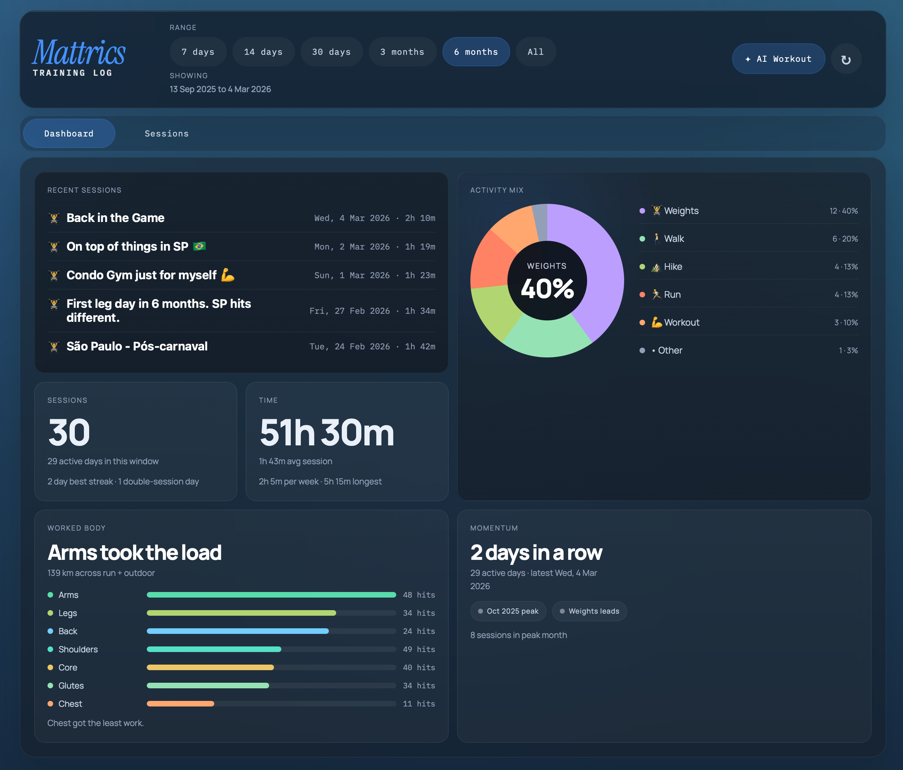
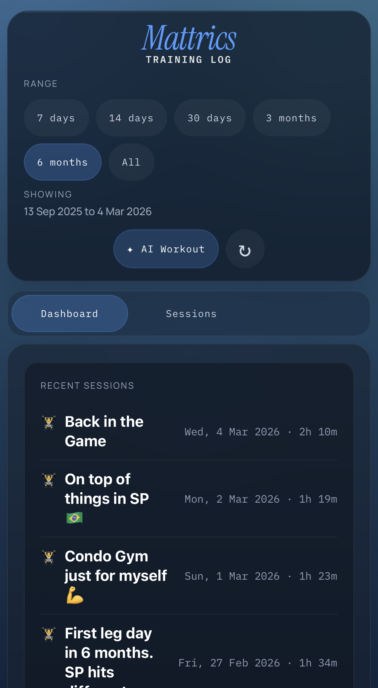

# Mattrics Training Log

Mattrics Training Log is a private training dashboard for reviewing recent workouts, spotting trends, and generating AI-assisted workout suggestions from your activity history.

It combines a lightweight frontend with a small PHP proxy, a Google Apps Script data endpoint, a private cached snapshot for resilient loading, and Anthropic-backed coaching prompts.

## Local Development

Docker-first local development is supported for the current architecture without a larger refactor.

Quick start:

```sh
docker compose up --build
```

Then open:

```text
http://localhost:8080/login.php
```

Useful commands:

```sh
docker compose exec app php tests/auth-security-tests.php
docker compose exec app node public/tests/settings-tests.js
docker compose exec app ./scripts/predeploy-guard.sh --check
docker compose down
docker compose down -v
```

Notes:

- `private/` remains local and writable, so cached data, settings, and passkey files persist across container restarts.
- Local Docker sets the app origin to `http://localhost:8080` and disables the production-only HTTPS requirement.
- Production deploy remains `./deploy.sh` and still targets only `public/`.

See [`docs/docker-local-dev.md`](/Users/mwieland/dev/MattricsTrainingLog/docs/docker-local-dev.md) for details.

## Live Site

[mattrics.mwieland.com](https://mattrics.mwieland.com/)

## Features

- Recent training feed with rolling time ranges such as 7 days, 14 days, 1 month, and all time
- Activity insights pulled from a Google Sheet through a token-protected endpoint with private server-side snapshot caching
- Optional AI workout suggestions without exposing the API key in the browser

## Screenshots

<p>
  
</p>

<p>
  
</p>
